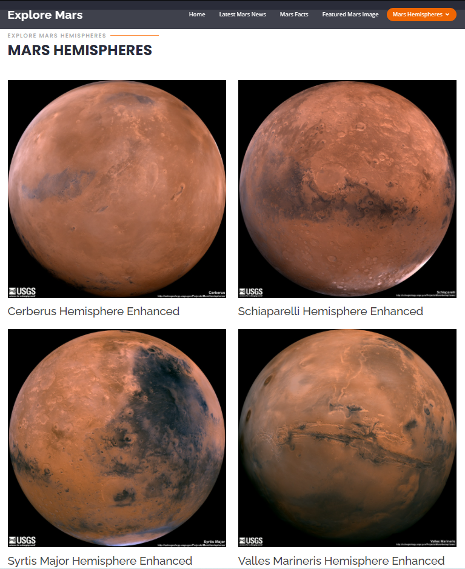

# Web Scraping Challenge - Mission to Mars


In this challenge, a web application was built that scrapes various websites for data related to the Mission to Mars and displays the information in a single HTML page. 

## Scraping

Initial scraping completed using Jupyter Notebook, BeautifulSoup, Pandas, and Requests/Splinter.

* Jupyter Notebook file called `mission_to_mars.ipynb` was used to complete all of your scraping and analysis tasks. The following outlines what scraped.

### NASA Mars News

* The [NASA Mars News Site](https://mars.nasa.gov/news/). Collected the latest News Title and Paragraph Text. 

### JPL Mars Space Images - Featured Image

* JPL Featured Space Image [here](https://data-class-jpl-space.s3.amazonaws.com/JPL_Space/index.html).

* Used splinter to navigate the site and find the image url for the current Featured Mars Image and assigned the url string to a variable called `featured_image_url`.

* Located the image url to the full size `.jpg` image.

* Saved image url as a complete url string for this image.

```python
# Example:
featured_image_url = 'https://data-class-jpl-space.s3.amazonaws.com/JPL_Space/image/featured/mars2.jpg'
```

### Mars Facts

* Mars Facts webpage [here](https://space-facts.com/mars/). Used Pandas to scrape the table containing facts about the planet including Diameter, Mass, etc.

* Used Pandas to convert the data to a HTML table string.

### Mars Hemispheres

* USGS Astrogeology site [here](https://astrogeology.usgs.gov/search/results?q=hemisphere+enhanced&k1=target&v1=Mars). Obtained high resolution image locations for each of Mar's hemispheres.

* Used splinter to click through each of the links to the hemispheres in order to find the image url to the full resolution image.

* Saved both the image url string for the full resolution hemisphere image, and the Hemisphere title containing the hemisphere name. Used a Python dictionary to store the data using the keys `img_url` and `title`.

* Appended the dictionary with the image url string and the hemisphere title to a list. This list will contain one dictionary for each hemisphere.

```python
# Example:
hemisphere_image_urls = [
    {"title": "Valles Marineris Hemisphere", "img_url": "..."},
    {"title": "Cerberus Hemisphere", "img_url": "..."},
    {"title": "Schiaparelli Hemisphere", "img_url": "..."},
    {"title": "Syrtis Major Hemisphere", "img_url": "..."},
]
```

- - -

## MongoDB and Flask Application

Used MongoDB with Flask templating to create a new HTML page that displays all of the information that was scraped from the URLs above.

* Started by converting my Jupyter notebook into a Python script called `scrape_mars.py` with a function called `scrape` that executes all of the scraping code from above and returns one Python dictionary containing all of the scraped data.

* Next, created a route called `/scrape` that will import your `scrape_mars.py` script and call your `scrape` function.

  * Stored the returned values in Mongo as a Python dictionary.

* Created a root route `/` that queries the Mongo database and passes the mars data into an HTML template to display the data.

* Created a template HTML file called `index.html` that will take the mars data dictionary and display all of the data in the appropriate HTML elements. Final web application with scraped mars data dynamically populated from the `scrape_mars.py` Python script.





### Note*
USGS Astrogeology site was up and working on 2/26/2021 [USGS Astrogeology site](https://astrogeology.usgs.gov/search/results?q=hemisphere+enhanced&k1=target&v1=Mars). This site was used to scrape the 4 hemisphere images. On 2/27/2021, the site went down. In my scrape_mars.py, if the site is unavailible, the app, uses a stored list of hemisphere_image_url dictionaries to pull in previously stored images and image titles. When the site is up again, it will pull in what is available from https://astrogeology.usgs.gov/search/results?q=hemisphere+enhanced&k1=target&v1=Mars.

Update: Later in the day on 2/27/2021, usgs website is up again.
- - -
